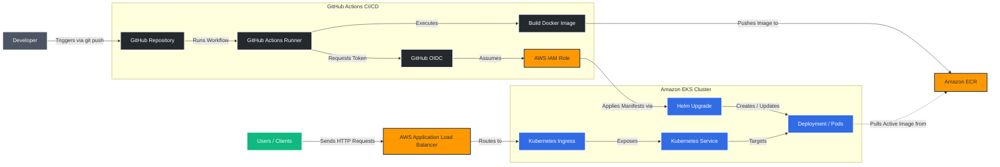

# Go API on EKS with GitHub Actions CI/CD

## Overview

This project demonstrates a complete CI/CD pipeline for deploying a Go application to Amazon EKS.

The pipeline automatically:

* Builds a Docker image
* Pushes the image to Amazon ECR
* Deploys the application to EKS using Helm
* Exposes the application through AWS Load Balancer Controller and ALB Ingress

Infrastructure provisioning is managed separately in the Terraform EKS project.

---

## Related Infrastructure Repository

The Kubernetes cluster and AWS infrastructure are provisioned using Terraform:

**Terraform EKS Infrastructure Repository**

* VPC
* EKS Cluster
* Managed Node Groups
* OIDC Provider
* IRSA
* AWS Load Balancer Controller
* S3 Remote State

This repository assumes that infrastructure already exists. Check https://github.com/whosthefunkyy/terraform-to-eks

---

## Tech Stack

* Go
* Docker
* Kubernetes
* Helm
* Amazon EKS
* Amazon ECR
* AWS ALB Ingress Controller
* GitHub Actions
* GitHub OIDC

---

## CI/CD Flow
GitHub Push → GitHub Actions → Build Docker Image → Push Image to Amazon ECR → Helm Upgrade / Install → Amazon EKS → AWS ALB Ingress → Application Available Online

## Repository Structure

## Kubernetes Components

This project deploys:

* Deployment
* Service (ClusterIP)
* Ingress (ALB)
* Horizontal Pod Autoscaler
* ServiceAccount
* ConfigMap
* ServiceMonitor (optional)

---

## Security

Authentication between GitHub Actions and AWS uses GitHub OIDC.

No long-lived AWS Access Keys are stored in GitHub Secrets.

GitHub assumes an IAM Role using OpenID Connect and receives temporary AWS credentials during workflow execution.

---

## Deployment

Every push to the main branch triggers:

1. Docker image build
2. Push to Amazon ECR
3. Helm deployment to EKS
4. Rollout verification

---

## Result

After deployment the application becomes accessible through an AWS Application Load Balancer created automatically by Kubernetes Ingress.
